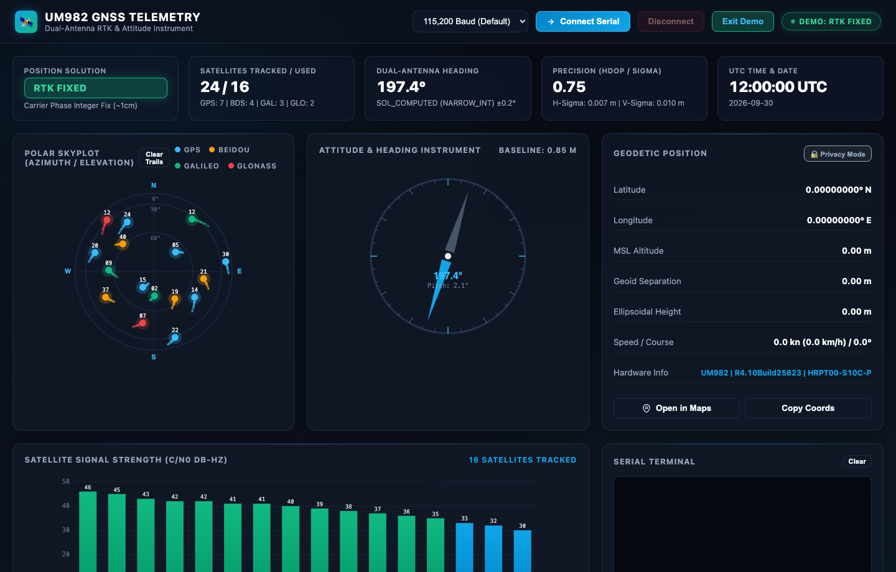

# UM982 Web GNSS & Attitude Dashboard

[](https://pgodlews.github.io/um982-dashboard-web/?demo=1)
[](https://github.com/pgodlews/um982-dashboard-web/actions/workflows/ci.yml)
[](https://github.com/pgodlews/um982-dashboard-web/actions/workflows/pages.yml)
[](LICENSE)
[](https://developer.mozilla.org/en-US/docs/Web/API/Web_Serial_API)

A zero-dependency, standalone **Web Serial telemetry and dual-antenna attitude dashboard** for the **Unicore UM982** and standard NMEA GNSS receivers.

Runs entirely in your web browser (Google Chrome, Microsoft Edge, Brave, Opera) using the native **Web Serial API**. No Node.js, no build steps, no Python drivers, and no external CDN dependencies required.

<p align="center">
  
</p>

> 🚀 **Try the Live Interactive Demo:** You can test the dashboard right now without any hardware connected:  
> **[https://pgodlews.github.io/um982-dashboard-web/?demo=1](https://pgodlews.github.io/um982-dashboard-web/?demo=1)**

---

## Features

* **Direct Web Serial Connection:** Connect straight to your USB-UART bridge (CH340, CP210x, FTDI) over `/dev/tty.*` or `COM*` with selectable baud rates (115,200, 230,400, 460,800, 9,600).
* **Polar Skyplot with Orbital Motion Trails:** Real-time polar projection displaying satellite azimuth ($0^\circ\text{--}360^\circ$) and elevation ($0^\circ\text{--}90^\circ$). As satellites orbit across the sky, dynamic dotted trails with directional fading beads trace their historical flight paths in matching constellation colors.
* **Dual-Antenna Heading & Attitude Compass:** Rotating needle instrument displaying True North heading, pitch angle, baseline distance between ANT1 and ANT2 (meters), and heading solution state (`SOL_COMPUTED`, `NARROW_FLOAT`, `NARROW_INT`).
* **Multi-Constellation Support:**
  * **GPS (Navstar)** — Electric Cyan (`#38bdf8`)
  * **BeiDou (BDS)** — Radiant Amber (`#f59e0b`)
  * **Galileo (GAL)** — Emerald Green (`#10b981`)
  * **GLONASS (GLO)** — Coral Red (`#ef4444`)
* **Live Satellite $C/N_0$ Spectrum:** High-resolution bar graph visualizing signal strength (Carrier-to-Noise ratio in dB-Hz) sorted by reception quality.
* **High-Precision Geodetic Telemetry:**
  * Latitude & Longitude to 8 decimal places
  * MSL Altitude, Geoid Undulation, and Ellipsoidal Height
  * Ground speed (knots & km/h) and Course over ground
  * HDOP and Horizontal/Vertical $1\sigma$ error statistics from `$GPGST`
* **1-Click Mapping & Clipboard:** Instant **"Open in Maps"** button to view current coordinates in Google Maps, plus a **"Copy Coords"** button.
* **Interactive Command Terminal:**
  * Real-time scrolling NMEA & Unicore log monitor
  * Quick-action buttons for common UM982 queries (`VERSION`, `CONFIG`, `ANTENNA`, `HEADING 5Hz`)
  * Command prompt to send custom Unicore ASCII commands directly to the receiver.
* **100% Standalone & Offline Ready:** Everything—styling, Canvas graphics engines, and protocol parsers—is packaged in a single, clean `index.html` file.

---

## Quick Start

### Option 1: Live Interactive Demo (Instant in Browser)
Test drive the dashboard with simulated RTK dual-antenna telemetry directly without any hardware:  
👉 **[Launch Live Demo: https://pgodlews.github.io/um982-dashboard-web/?demo=1](https://pgodlews.github.io/um982-dashboard-web/?demo=1)**

### Option 2: Direct Local Launch
Double-click `index.html` or run in your terminal:

```bash
# macOS
open -a "Google Chrome" index.html

# Linux
google-chrome index.html

# Windows
start chrome index.html
```

### Option 3: Host on GitHub Pages
You can host this repository directly on your own **GitHub Pages** with zero configuration:
1. Go to repository settings on GitHub $\rightarrow$ **Pages**.
2. Select branch `main` and root folder `/`.
3. Open your GitHub Pages URL in Google Chrome!

### Option 4: Local HTTP Server
```bash
python3 -m http.server 8000
```
Then navigate to `http://localhost:8000` in Google Chrome or Microsoft Edge.

---

## Connecting to Your Receiver

1. Plug your **UM982** carrier board into your computer via USB.
2. Open the dashboard in Google Chrome.
3. Select your baud rate (default is **115,200 baud**).
4. Click **"Connect Serial"** and choose your device in Chrome's permission dialog (e.g. `USB Serial`, `CH340`, or `/dev/cu.usbserial-*`).
5. Watch the telemetry stream, compass needle, and skyplot initialize immediately!

> **Note on Serial Ports:** The serial port requires exclusive access. Ensure no other application (such as a terminal monitor, Python script, or ROS node) is using the port before clicking Connect in Chrome.

---

## Supported Protocols & Sentences

| Protocol | Formats Parsed | Description |
| :--- | :--- | :--- |
| **NMEA 0183** | `$GNGGA`, `$GPGGA` | 3D Position fix, quality code, altitude, geoid separation, satellite count, HDOP |
| **NMEA 0183** | `$GNRMC`, `$GPRMC` | Speed over ground, true course, UTC time & GPS date |
| **NMEA 0183** | `$GPGSV`, `$GBGSV`, `$GAGSV`, `$GLGSV` | Satellites in view, elevation, azimuth, and $C/N_0$ signal levels across constellations |
| **NMEA 0183** | `$GPGST`, `$GNGST` | Pseudorange error statistics ($1\sigma$ latitude, longitude, and altitude standard deviation) |
| **Unicore ASCII** | `#HEADINGA`, `#UNIHEADINGA` | Dual-antenna baseline length, heading angle, pitch angle, solution quality, standard deviation |
| **Unicore ASCII** | `#VERSION`, `#VERSIONA` | Firmware build, hardware model, serial number, compilation date |
| **Unicore ASCII** | `#ANTENNAA` | Primary (ANT1) and Secondary (ANT2) active antenna RF bias and status |
| **Unicore Response** | `$command,...`, `$CONFIG,...` | Command echo, response acknowledgment, and configuration parameter dump |

---

## Hardware Compatibility

Tested and verified on:
* **Unicore UM982** (High-Precision RTK Positioning & Dual-Antenna Heading Module)
* Carrier boards including `HRPT00-S10C-P`, SparkFun, ArduSimple, Holybro, and generic USB-UART breakout carriers.
* Compatible with any generic NMEA 0183 GNSS receiver (u-blox, Septentrio, Quectel, MediaTek) for standard positioning and skyplot features.

---

## License

This project is licensed under the **MIT License** — see the [LICENSE](LICENSE) file for details.

Copyright (c) 2026 Piotr Godlewski.
